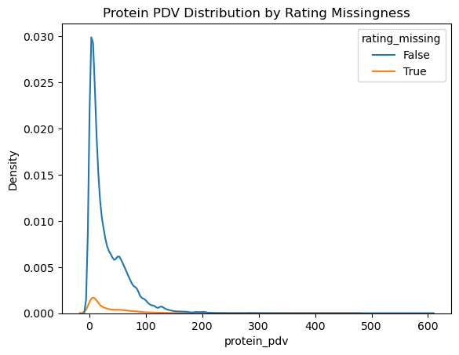
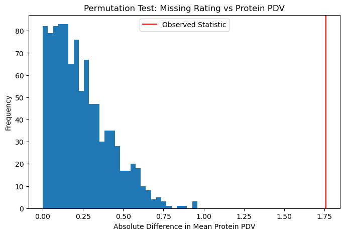
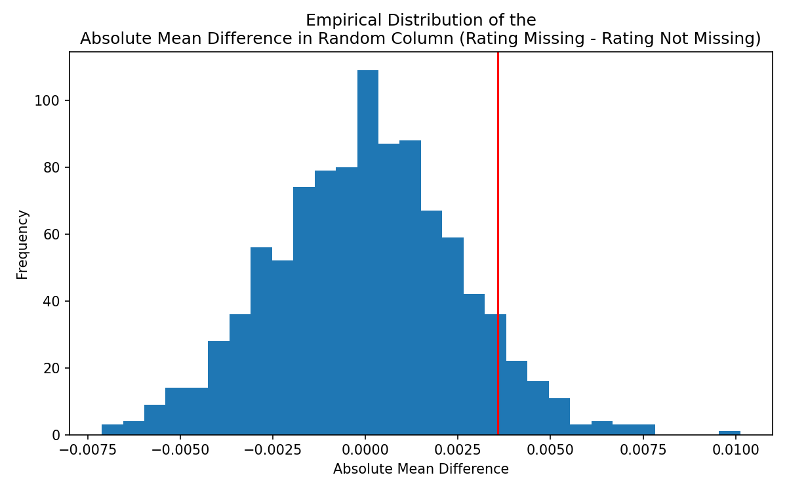

# Do Healthier Recipes Take Longer? An Analysis of Fitness-Oriented Nutrition and Preparation Time

## Introduction

A common belief is that eating healthy meals, especially high-protein dishes, takes more time than cooking regular meals. Because of this perception, many people avoid meal prepping since they believe it is too time-consuming or inconvenient.

This project investigates whether that belief is actually supported by data.

Specifically, we explore whether meals that are higher in protein and more nutrition-focused take longer to prepare than other types of meals. This question matters because time is one of the most frequently cited barriers to eating healthier or maintaining a fitness-oriented diet. If healthier meals do not take substantially longer to prepare, this challenges the idea that meal prepping is too time-intensive and suggests that eating well may be more accessible than people think.

The first dataset, `recipe`, contains **83,782 rows**, representing 83,782 unique recipes, with several columns describing recipe information.

| Column | Description |
|--------|-------------|
| `name` | Recipe name |
| `id` | Recipe ID |
| `minutes` | Minutes required to prepare the recipe |
| `contributor_id` | User ID who submitted the recipe |
| `submitted` | Date the recipe was submitted |
| `tags` | Food.com tags describing the recipe (e.g., dinner, dessert, low-fat, easy) |
| `nutrition` | Nutrition information in the format [calories (#), total fat (PDV), sugar (PDV), sodium (PDV), protein (PDV), saturated fat (PDV), carbohydrates (PDV)] |
| `n_steps` | Number of preparation steps |
| `steps` | Text describing the recipe steps |
| `description` | User-provided description |
| `ingredients` | Text describing the ingredients |
| `n_ingredients` | Number of ingredients in the recipe |

The second dataset, `interactions`, contains **731,927 rows**, where each row represents a user interaction with a recipe.

| Column | Description |
|--------|-------------|
| `user_id` | User ID |
| `recipe_id` | Recipe ID |
| `date` | Date of the interaction |
| `rating` | Rating given by the user |
| `review` | Text review written by the user |

To answer our research question, we focus on the following relevant columns:

| Column | Description |
|--------|-------------|
| `minutes` | Total time required to prepare the recipe |
| `nutrition` | Nutrition information in the format [calories (#), total fat (PDV), sugar (PDV), sodium (PDV), protein (PDV), saturated fat (PDV), carbohydrates (PDV)] |
| `n_steps` | Number of preparation steps required |

Given the datasets, we investigate whether recipes that align more closely with fitness-oriented nutrition differ in preparation time compared to less nutritious recipes. To facilitate this analysis, we first separated the values stored in the `nutrition` column into their corresponding columns, including `calories (#)`, `total fat (PDV)`, `sugar (PDV)`, `protein (PDV)`, and others. PDV, or percent daily value, represents how much a nutrient in a serving of food contributes to the recommended daily intake.

Using these nutritional variables, we constructed a measure of recipe “fitness” based on the difference between protein and fat daily value percentages (`protein_pdv - total_fat_pdv`). Recipes with relatively higher protein content and lower fat content were categorized as **High Fitness**, while the remaining recipes were categorized as **Low Fitness**. This grouping allows us to compare preparation times between recipes that are more aligned with fitness-oriented nutrition and those that are not.

The most relevant columns for answering our question include `minutes`, which records the total preparation time of each recipe, `protein_pdv` and `fat_pdv`, which represent the nutritional composition of the recipe, and `n_steps` and `n_ingredients`, which capture the structural complexity of the recipe.

## Data Cleaning

To prepare the dataset for analysis, we performed several data cleaning and transformation steps. First, we merged the `recipes` and `interactions` datasets so that each recipe contains both its nutritional information and user interaction data such as ratings. The merge was performed using the recipe ID as the key.

Next, we replaced ratings of `0` with missing values (`NaN`). In this dataset, a rating of zero does not represent an actual rating but instead indicates that a user did not leave a rating. Treating these values as missing prevents them from artificially lowering average rating calculations.

Because each recipe can receive multiple ratings, we then calculated the **average rating for each recipe** by grouping by recipe ID and computing the mean rating across users. This value was stored in a new column called `avg_rating`.

The original dataset stores nutrition information as a list inside the `nutrition` column. To make these values usable for analysis, we separated this column into individual numeric columns representing each nutrient:

- calories  
- total fat (PDV)  
- sugar (PDV)  
- sodium (PDV)  
- protein (PDV)  
- saturated fat (PDV)  
- carbohydrates (PDV)  

PDV (Percent Daily Value) represents how much a nutrient contributes to the recommended daily intake.

To reduce the influence of extreme outliers, we removed recipes with calorie values greater than **2000 calories**, as these likely represent bulk mixtures or ingredient blends rather than individual recipes. We also removed recipes with preparation times greater than **600 minutes** or less than or equal to zero.

Finally, we constructed a **fitness score** to measure how aligned a recipe is with fitness-oriented nutrition: recipes with relatively higher protein and lower fat content receive higher scores.

To simplify comparisons, recipes were divided into two groups based on the **median fitness score**:

- **High Fitness** – recipes with scores above the median  
- **Low Fitness** – recipes with scores below the median  

---

## Distribution of Preparation Time

<iframe src="images/univariate1.html" width="900" height="500"></iframe>

The distribution of preparation time is strongly **right-skewed**, meaning most recipes require relatively short preparation times while a smaller number take much longer. The majority of recipes fall below approximately 100 minutes, though a long tail extends toward more complex recipes with longer preparation times. This pattern supports our decision to remove extreme outliers above 600 minutes during the cleaning process.

---

## Distribution of Fitness Score

<iframe src="images/univariate2.html" width="900" height="500"></iframe>

The distribution of the fitness score is centered around zero with both positive and negative values. Recipes with higher scores tend to have relatively higher protein content compared to fat, while negative scores indicate recipes with relatively higher fat content. This distribution allows us to divide recipes into **High Fitness** and **Low Fitness** groups for further analysis.

---

## Fitness Score vs Preparation Time

<iframe src="images/bivariate1.html" width="900" height="500"></iframe>

This scatter plot shows the relationship between recipe fitness score and preparation time. Although preparation time varies widely across recipes, there appears to be a slight tendency for recipes with higher fitness scores to have longer preparation times. However, the relationship is not strongly linear, suggesting that other factors such as recipe complexity may also influence preparation time.

---

## Average Preparation Time by Fitness Alignment

<iframe src="images/bivariate2.html" width="900" height="500"></iframe>

This bar chart compares the average preparation time between **High Fitness** and **Low Fitness** recipes. Recipes categorized as high fitness appear to take longer on average than low fitness recipes. This pattern suggests that healthier recipes may require more preparation effort, possibly due to additional ingredients or more involved cooking techniques.

---

## Interesting Aggregates

To further explore how recipe complexity influences preparation time, we created a pivot table that groups recipes by both **fitness alignment** and **number of preparation steps**. Recipes were divided into step-count categories ranging from very few steps to many steps. The table reports the **mean, median, and count** of preparation times within each group.

| Fitness Group | Step Group | Mean Minutes | Median Minutes | Count |
|---|---|---|---|---|
| High Fitness | Very Few | 67.39 | 15 | 10291 |
| High Fitness | Few | 67.91 | 30 | 21448 |
| High Fitness | Moderate | 66.20 | 40 | 45343 |
| High Fitness | Many | 77.11 | 50 | 28554 |
| Low Fitness | Very Few | 23.55 | 10 | 16737 |
| Low Fitness | Few | 36.88 | 20 | 28727 |
| Low Fitness | Moderate | 47.12 | 35 | 48648 |
| Low Fitness | Many | 66.48 | 50 | 26038 |

From this table we observe that recipes with **more preparation steps generally require longer preparation times**, which is expected since additional steps typically correspond to more complex cooking processes. However, even within the same step category, **High Fitness recipes consistently require more preparation time than Low Fitness recipes**. This suggests that healthier recipes may require additional preparation effort not fully captured by step count alone.

## Assessment of Missingness

Three columns — `date`, `rating`, and `review` — in the merged dataset contain a substantial amount of missing values. Because these variables capture user interaction with recipes, we assessed whether their missingness may be related to characteristics of the recipes themselves.

### MNAR Analysis

We believe that the missingness of the `review` column may be MNAR. Users are less likely to leave a review if they feel neutral or indifferent about a recipe, since writing a review requires time and effort. In contrast, users who feel strongly about a recipe — either positively or negatively — are more likely to share their experiences. This suggests that the likelihood of a review being missing depends on the user’s underlying opinion of the recipe, which is unobserved when no review is written.

### Missingness Dependency

We next examined the missingness of `rating` in the merged DataFrame by testing whether its missingness depends on other variables in the dataset. Specifically, we investigated whether the missingness of `rating` depends on `protein_pdv`, which represents the protein percentage daily value of the recipe, or on a randomly generated column `random_col`.

---

### Protein PDV and Rating

**Null Hypothesis:** The missingness of `rating` does not depend on the protein percentage daily value of the recipe.

**Alternative Hypothesis:** The missingness of `rating` does depend on the protein percentage daily value of the recipe.

**Test Statistic:** The absolute difference in mean `protein_pdv` between the distribution of recipes with missing ratings and the distribution of recipes without missing ratings.

**Significance Level:** 0.05

We ran a permutation test by shuffling the missingness of `rating` 1000 times to generate simulated differences in the mean protein PDV between the two groups.

The observed statistic is indicated by the red vertical line on the permutation distribution. Since the p-value we obtained (0.0) is less than the significance level of 0.05, we reject the null hypothesis. This suggests that the missingness of `rating` depends on `protein_pdv`.

---

### Random Column and Rating

**Null Hypothesis:** The missingness of `rating` does not depend on `random_col`.

**Alternative Hypothesis:** The missingness of `rating` does depend on `random_col`.

**Test Statistic:** The absolute difference in mean `random_col` between recipes with missing ratings and recipes without missing ratings.

**Significance Level:** 0.05

We ran another permutation test by randomly shuffling the missingness of `rating` 1000 times to simulate the distribution of mean differences between the two groups.

The observed statistic is indicated by the red vertical line on the permutation distribution. Since the p-value we obtained (0.153) is greater than 0.05, we fail to reject the null hypothesis. This suggests that the missingness of `rating` does not depend on `random_col`, which is consistent with what we would expect from a randomly generated variable.

---

Overall, these results suggest that the missingness of ratings is not completely random. Instead, it appears to depend on certain recipe characteristics such as protein content, indicating that the data are unlikely to be Missing Completely At Random (MCAR).
